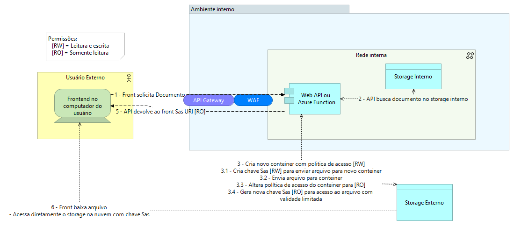
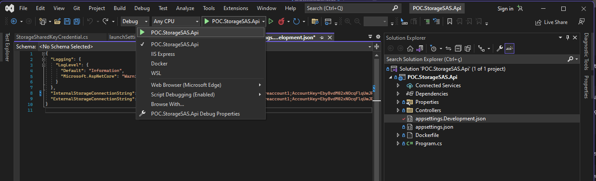

<p align="center">
  <h1 align="center">POC.StorageSAS.Api</h1>
  <p align="center">
    Poc para validar acesso seguro a arquivos em Storage Azure com chave SAS
  </p>
</p>

________________

<br />


## Sobre a aplicação

Web API com endpoint para obtenção de link para download de aquivlo blob a partir de uma conta de storage da Azure.
A API se conecta a duas contas de storage, sendo que uma delas pode estar segura dentro da mesma rede privada que a aplicação, onde se localizam os documentos. Há també outra conta de storage disponível para acesso via internet, onde os documentos são disponibilizados para download com link usando Chave SAS com validade e acesso restritos.

Para cada solicitação será criado um novo conteiner que receberá o arquivo solicitado. Esse conteiner receberá uma política de acesso tipo RO (Somente leitura) e a chave Sas criada para acesso ao arquivo també terá permissão somente leitura.

Dessa maneira, temos uma storage onde os arquivos são gerados e armazenados e podem ser manipulados diretament pelas aplicações, sendo que tudo ficaria dentro da mesma rede. Teremos também outra conta que será usada somente para disponibilizar download seguro do arquivo para os clientes sem ter a necessidade de proteger o acesso com API Gateway ou mesmo WAF, que podem prejudicar o download de arquivos muito grandes.

### Desenho da proposta




### Endpoint **Storage**

Ao rodar o sistema há apenas um endpoint. Esse serviço recebe os dados de localicação do arquivo no conteiner de origem. É necessário informar o nome do arquivo e o conteiner no qual ele está armazenado. A API irá copiar o arquivo para um storage externo e disponibilizar o link para download do arquivo.

### Principais Tecnologias

A API está integrada a um serviço de storage da Azure. É possível usar uma conta criada diretamente na nuvem ou também emular o storage na máquina local usando o emulador Azurite.

- [.NET 6.0](https://dotnet.microsoft.com/)
- [Azurite](https://github.com/Azure/Azurite)
- [Visual Studio Community](https://visualstudio.microsoft.com/pt-br/vs/community/)

### Pré-Requisitos

- [.NET 6.0](https://dotnet.microsoft.com/) instaldo e configurado.
- [Emulador Azurite](https://docs.microsoft.com/pt-br/azure/storage/common/storage-use-azurite?tabs=visual-studio) ou contas de armazenamento da Azure

As configurações necessárias para conectar a API aos serviços de banco de dados e contas de armazenamento estão localizadas no arquivo appsettings.Development.json.


### Como rodar

Primeiro é necessário clonar esse repositório em seu computador local.

- Clonando repositório

  ```sh
  git clone https://github.com/unixelias/POC.StorageSAS.Api.git
  cd ECA.CBF.Demo.Api
  ```

Altere o arquiovo de configurações para inserir as strings de conexão das contas de armazenamento.

 Em seguida, tendo os serviços configurados, basta usar o dotnet para iniciar a aplicação conforme segue:

- Utilizando o dotnet

  ```sh
  dotnet restore POC.StorageSAS.Api.sln
  dotnet run --project POC.StorageSAS.Api/POC.StorageSAS.Api.csproj
  ```

Ao iniciar a aplicação é disponibilizada uma interface baseada em Swagger. Essa interface é baseada em OpenApi 3.0 e pode ser usada para tesar os endpoints disponibilizados, contendo ainda os contratos usados nos endpoints com exemplos.


### Rodando com Visual Studio

A maneira mais fácil de rodar esse projeto é pelo Visual Studio, que é o SDK do .NET. Basta abrir o arquivo **POC.StorageSAS.Api.sln**.
Ao abrir o projeto, você pode usar a confirurção predefinida para iniciar o sistema, conforme imagem abaixo:




## Licença

MIT License.
